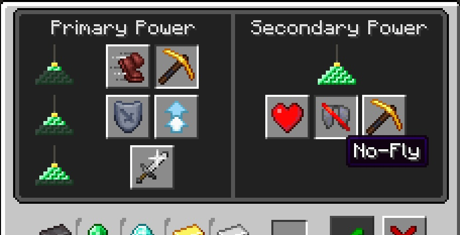

# No-Fly Zone

**Minecraft 26.x; Fabric and NeoForge.**

Give a beacon a **No-Fly** effect and elytra stop working inside its range.
Takeoff is refused, and anyone who glides in from outside has their wings disabled
and falls. Riptide tridents and firework boosts are blocked too, so nothing
gets you airborne inside the zone.

The zone is exactly the beacon's own effect range, follows all the usual beacon
rules, and is visibly anchored to something players can find, build, and break.

## Installation

**Enforcement is server-side.** The jar goes in the server's `mods/` folder, and
every player is subject to every zone whether or not they have the mod — a
completely unmodified vanilla client is affected exactly like anyone else.

The same jar on a *client* adds the No-Fly button to the beacon screen. That is
only needed to **set up** a no-fly beacon; see [Configuring a beacon](#configuring-a-beacon).

### Fabric servers

Requires the correct [fabric-api jar](https://modrinth.com/mod/fabric-api) on
the server.

Copy [`noflyzone-fabric-X.X.X.jar`](https://github.com/tomgidden/minecraft-noflyzone/releases) to the server's `mods/` folder.

### NeoForge servers

Copy [`noflyzone-neoforge-X.X.X.jar`](https://github.com/tomgidden/minecraft-noflyzone/releases) to the server's `mods/` folder.

## Usage

Build a full beacon as normal, and give it the **No-Fly** effect. While that
beacon is active, elytra don't work in its range.

- **Activating Elytra** in the zone is prevented.
- **Riptide** tridents won't launch, and **firework rockets** won't boost.
- and **flying into the zone** has one of three effects:
  - `zero-momentum` (default): You're slowed to walking pace but keep gliding, so you drift down and land safely.
  - `no-glide`: Elytra are immediately disabled, as if they broke. Hope you have Feather Falling IV…
  - `damage`: You keep flying and keep control, but take steady damage as though being shot down. Scary, survivable with armour.

### Without the client mod

The mod functions properly on the server alone, but the client-side mod neatens
things up. It's not all-or-nothing, though: some players can use the mod, while
others don't.

Players without the mod installed on their clients:

- **are** fully affected by every no-fly zone,
- **can't** select `No-Fly` when building their own beacon,
- see "nothing selected" if they open a no-fly beacon's screen (harmless).

A No-Fly beacon grants no potion effect — picking No-Fly is exclusive, exactly
as picking Haste means you don't get Speed. One beacon, one job.

## Configuring a beacon

There are two ways to configure a beacon for No-Fly.

### With the client-side mod

If you have this mod installed client-side as well as server-side, you can just
use the beacon screen normally; in the Tier-4 row next to Regeneration, you'll
find the "No-Fly" effect.

There's currently no way to set `zero-momentum`/`no-glide`/`damage` from the
game UI; you'll need to be a server op to set that (see below)

### Server-side-only

If you haven't installed the mod, then you need to be a server op to run the
`/noflyzone` function.  Stand next to the beacon you want to configure, and
execute `/noflyzone on` or `/noflyzone off` and that should configure the beacon
accordingly. 

You can also use `/noflyzone status` to check, and `/noflyzone mode`
to change between `zero-momentum`, `no-glide` and `damage` modes.

The mode is server-wide; you can't have different modes for different beacons.

You can also edit `config/noflyzone.properties` (once the game has run once,
which should create that file) to set the configuration.

## Single-player

Dropping the jar into a singleplayer client's `mods/` folder gives you both
halves at once — you can build and configure no-fly beacons, and they work. This
also covers "Open to LAN".

If a world is later moved to a server without the mod, no-fly beacons quietly
become ordinary beacons that grant no effect.

## License and stuff

This mod is covered by the [MIT License](LICENSE.txt).

In short, you may freely use this mod in any modpack, but just don't claim you
made it. No promises, no warranties, so don't blame me if it breaks anything or
disadvantages you in some way, or you believe it did.

[Comments and improvements welcome.](https://github.com/tomgidden/minecraft-noflyzone)

-- `_gid`

